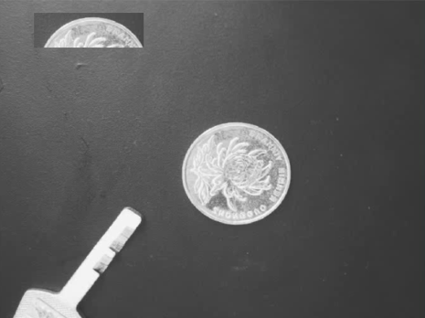
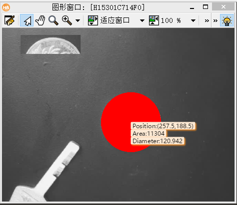

# 机器视觉作业7

SZ170320207

刘健恒

# 0.初始输入图片



# 1.Halcon代码

```cpp
* Image Acquisition 01: Code generated by Image Acquisition 01
dev_close_window ()
dev_update_window ('off')
read_image (Image, 'D:/OneDrive - stu.hit.edu.cn/Lessons/Machine_Vision/Homeworks/7/实验图像.bmp')
get_image_size (Image, Width, Height)
dev_open_window(0, 0, Width, Height, 'black', WindowHandle) 
dev_display(Image)
threshold (Image, Region, 128, 255)
opening_circle (Region, RegionOpening, 3.5)
connection (RegionOpening, ConnectedRegions)
select_shape (ConnectedRegions, SelectedRegions, 'circularity', 'and', 0.7, 1)
shape_trans (SelectedRegions, RegionTrans, 'outer_circle')
smallest_circle (RegionTrans, Row, Column, Radius)
area_center (RegionTrans, Area, Row1, Column1)
dev_display (Image)
disp_circle (WindowHandle, Row, Column, Radius)
disp_message (WindowHandle, 'Position:('+Column+','+Row+')', 'window', Row, Column, 'black', 'true')
disp_message (WindowHandle, 'Area:'+Area, 'window', Row+15, Column, 'black', 'true')
disp_message (WindowHandle, 'Diameter:'+2*Radius, 'window', Row+30, Column, 'black', 'true')
dev_update_window ('on') //更新窗体

```

# 2.结果



