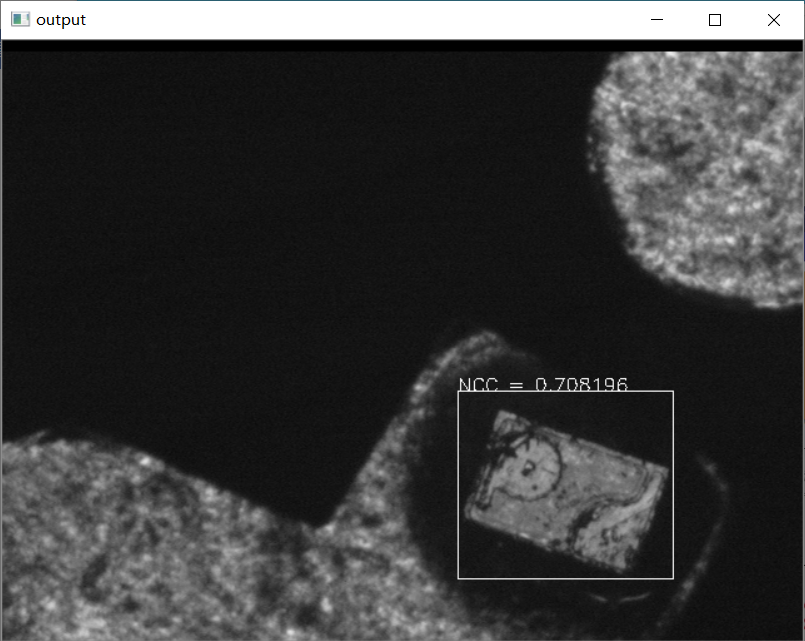

# 机器视觉作业8

SZ170320207

刘健恒

# 0.结果




# 1.结论

一层NCC的模板匹配耗时较长，没有实时实用的价值。但能有效的检测出目标的位置以及相似程度

# 2.代码

采用了许多提前算好的量以及结合律等节省运算量，但效率仍不太高

```cpp
//
// Created by chrisliu on 2020/4/9.
//

#include <iostream>
#include <opencv2/opencv.hpp>
#include <opencv2/core/core.hpp>
#include <opencv2/imgproc/imgproc.hpp>
#include <opencv2/highgui/highgui.hpp>

using namespace std;
using namespace cv;

struct template_data
{
	Mat Img;
	int rows = 0;
	int cols = 0;
	int n = 0;
	float m_t = 0;
	float s_t = 0;

	Mat firstItem;
};

void NCC_Matching_Init(template_data& inputTemplate, Mat templateImg)
{
	inputTemplate.Img = templateImg;

	int rows = templateImg.rows;
	int cols = templateImg.cols;

	inputTemplate.rows = rows;
	inputTemplate.cols = cols;
	inputTemplate.n = rows * cols;

	inputTemplate.m_t = 0;
	for (int i = 0; i < rows; i++)
	{
		for (int j = 0; j < cols; j++)
		{
			inputTemplate.m_t += inputTemplate.Img.at<uchar>(i, j);
		}
	}
	inputTemplate.m_t /= inputTemplate.n;

	inputTemplate.s_t = 0;
	for (int i = 0; i < rows; i++)
	{
		for (int j = 0; j < cols; j++)
		{
			inputTemplate.s_t += pow(inputTemplate.Img.at<uchar>(i, j) - inputTemplate.m_t, 2);
		}
	}
	inputTemplate.s_t /= inputTemplate.n;
	inputTemplate.s_t = sqrt(inputTemplate.s_t);

	inputTemplate.firstItem = Mat(rows, cols, CV_32FC1);
	for (int i = 0; i < rows; i++)
	{
		for (int j = 0; j < cols; j++)
		{
			inputTemplate.firstItem.at<float>(i, j) = (inputTemplate.Img.at<uchar>(i, j) - inputTemplate.m_t) / inputTemplate.s_t;
		}
	}
}

Mat NCC_Matching(Mat inputImage, template_data inputTemplate, float threshold_NCC = 0.7)
{
	Mat outputImage = inputImage;

	int image_rows = inputImage.rows;
	int image_cols = inputImage.cols;

	float NCCxN = 0;
	float NCC = 0;
	string text = "NCC=";
	bool isFind = false;
	float NCCmax = 0;

	float m_f = 0;
	float s_f = 0;

	for (int i = 0; i < image_rows - inputTemplate.rows; i = i++)
	{
		for (int j = 0; j < image_cols - inputTemplate.cols; j = j++)
		{
			m_f = 0;
			for (int u = 0; u < inputTemplate.rows; u++)
			{
				for (int v = 0; v < inputTemplate.cols; v++)
				{
					m_f += inputImage.at<uchar>(i + u, j + v);
				}
			}
			m_f /= inputTemplate.n;

			s_f = 0;
			for (int u = 0; u < inputTemplate.rows; u++)
			{
				for (int v = 0; v < inputTemplate.cols; v++)
				{
					s_f += pow(inputImage.at<uchar>(i + u, j + v) - m_f, 2);
				}
			}
			s_f /= inputTemplate.n;
			s_f = sqrt(s_f);

			float temp = 0;
			for (int u = 0; u < inputTemplate.rows; u++)
			{
				for (int v = 0; v < inputTemplate.cols; v++)
				{
					NCCxN += inputTemplate.firstItem.at<float>(u, v) * (inputImage.at<uchar>(i + u, j + v) - m_f);
				}
			}
			NCC = NCCxN / inputTemplate.n / s_f;
			NCCxN = 0;
			if (NCC >= threshold_NCC)
			{
				
				if (NCC > NCCmax)
				{
					NCCmax = NCC;
				}
				else
				{
					putText(outputImage, "NCC = " +to_string(NCC), Point(j-1, i-1), FONT_HERSHEY_SIMPLEX, 0.5, Scalar(255));
					rectangle(outputImage, Rect(j-1, i-1, inputTemplate.cols, inputTemplate.rows), Scalar(255));
					cout << "Position=(" + to_string(i) + "," + to_string(j) + ")" << endl;
					cout << "NCCmax=" << NCCmax << endl;
					isFind = true;
					break;
				}
			}
		}

		if (isFind)
		{
			break;
		}
	}
	return outputImage;
}

int main(int argc, char** argv)
{
	template_data inputTemplate;
	Mat templateImg = imread("D:/OneDrive - stu.hit.edu.cn/Lessons/Machine_Vision/Homeworks/8/Images/pattern.bmp");
	cvtColor(templateImg, templateImg, COLOR_RGB2GRAY);
	imshow("templateImg", templateImg);
	NCC_Matching_Init(inputTemplate, templateImg);
	cout << 1 << endl;
	for (int i = 15; i <= 34; ++i)
	{
		Mat input_Image = imread("D:/OneDrive - stu.hit.edu.cn/Lessons/Machine_Vision/Homeworks/8/Images/IMAGEB" + to_string(i) + ".bmp");
		cvtColor(input_Image, input_Image, COLOR_RGB2GRAY);
		imshow("input_Image", input_Image);
		//计时
		double time_consumed = cv::getTickCount();
		Mat output = NCC_Matching(input_Image, inputTemplate);
		time_consumed = (cv::getTickCount() - time_consumed) / cv::getTickFrequency();
		cout << "耗时：" << time_consumed << " s" << endl;
		imshow("output", output);
		/*cout << inputTemplate.m_t << endl;
		cout << inputTemplate.s_t << endl;
		cout << inputTemplate.template_cols << endl;
		cout << inputTemplate.template_rows << endl;
		cout << inputTemplate.template_n << endl;*/
		cout << 1 << endl;
		waitKey(0);
	}
	return 0;
}
```

