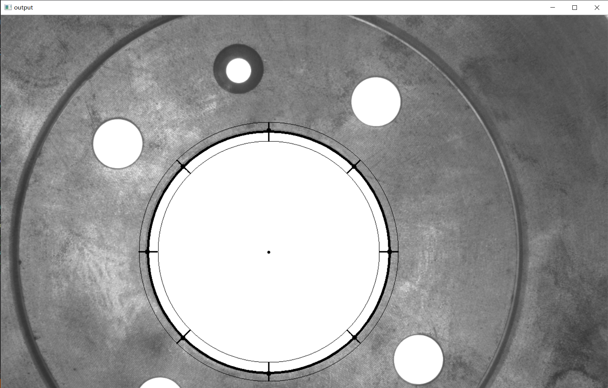
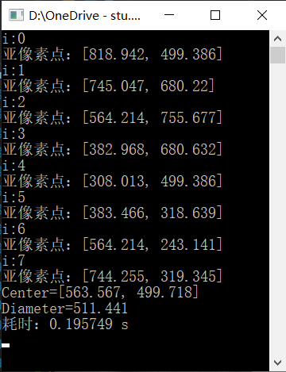

# 机器视觉作业8

SZ170320207

刘健恒

# 0.结果





# 1.代码

```cpp
//
// Created by chrisliu on 2020/4/9.
//

#include <iostream>
#include <opencv2/opencv.hpp>
#include <opencv2/core/core.hpp>
#include <opencv2/imgproc/imgproc.hpp>
#include <opencv2/highgui/highgui.hpp>

using namespace std;
using namespace cv;

#define PI 3.1415926535

//拟合圆
Point3f LeastSquareFittingCircle(vector<Point2f> temp_coordinates)//高斯消元法直接求解方程组
{
	float x1 = 0;
	float x2 = 0;
	float x3 = 0;
	float y1 = 0;
	float y2 = 0;
	float y3 = 0;
	float x1y1 = 0;
	float x1y2 = 0;
	float x2y1 = 0;
	int num;
	vector<Point2f>::iterator k;
	Point3f tempcircle;
	for (k = temp_coordinates.begin(); k != temp_coordinates.end(); k++)
	{

		x1 = x1 + (*k).x;
		x2 = x2 + (*k).x * (*k).x;
		x3 = x3 + (*k).x * (*k).x * (*k).x;
		y1 = y1 + (*k).y;
		y2 = y2 + (*k).y * (*k).y;
		y3 = y3 + (*k).y * (*k).y * (*k).y;
		x1y1 = x1y1 + (*k).x * (*k).y;
		x1y2 = x1y2 + (*k).x * (*k).y * (*k).y;
		x2y1 = x2y1 + (*k).x * (*k).x * (*k).y;
	}
	float C, D, E, G, H, a, b, c;
	num = temp_coordinates.size();
	C = num * x2 - x1 * x1;
	D = num * x1y1 - x1 * y1;
	E = num * x3 + num * x1y2 - x1 * (x2 + y2);
	G = num * y2 - y1 * y1;
	H = num * x2y1 + num * y3 - y1 * (x2 + y2);
	a = (H * D - E * G) / (C * G - D * D);
	b = (H * C - E * D) / (D * D - G * C);
	c = -(x2 + y2 + a * x1 + b * y1) / num;
	tempcircle.x = -a / 2; //圆心x坐标
	tempcircle.y = -b / 2;//圆心y坐标
	tempcircle.z = sqrt(a * a + b * b - 4 * c) / 2;//圆心半径
	return tempcircle;
}

//拟合曲线
bool polynomial_curve_fit(std::vector<cv::Point2f>& key_point, int n, cv::Mat& A)
{
	//Number of key points
	int N = key_point.size();

	//构造矩阵X
	cv::Mat X = cv::Mat::zeros(n + 1, n + 1, CV_32FC1);
	for (int i = 0; i < n + 1; i++)
	{
		for (int j = 0; j < n + 1; j++)
		{
			for (int k = 0; k < N; k++)
			{
				X.at<float>(i, j) = X.at<float>(i, j) +
					std::pow(key_point[k].x, i + j);
			}
		}
	}

	//构造矩阵Y
	cv::Mat Y = cv::Mat::zeros(n + 1, 1, CV_32FC1);
	for (int i = 0; i < n + 1; i++)
	{
		for (int k = 0; k < N; k++)
		{
			Y.at<float>(i, 0) = Y.at<float>(i, 0) +
				std::pow(key_point[k].x, i) * key_point[k].y;
		}
	}

	A = cv::Mat::zeros(n + 1, 1, CV_32FC1);
	//求解矩阵A
	cv::solve(X, Y, A, cv::DECOMP_LU);
	return true;
}

Mat Circle_Detection(Mat input)
{
	int rows = input.rows;
	int cols = input.cols;

	Mat output = Mat::zeros(rows, cols, CV_8UC1);
	int temp = 0;
	for (int i = 0; i < rows; ++i)
	{
		temp = abs(input.at<uchar>(i, 1) - 0) / 2;
		if (temp > 50)
			output.at<uchar>(i, 0) = 255;
		for (int j = 1; j < cols - 1; ++j)
		{
			temp = abs(input.at<uchar>(i, j + 1) - input.at<uchar>(i, j - 1)) / 2;
			if (temp > 50)
				output.at<uchar>(i, j) = 255;
		}
		temp = abs(0 - input.at<uchar>(i, cols - 2)) / 2;
		if (temp > 50)
			output.at<uchar>(i, cols - 1) = 255;
	}
	vector<vector<Point> > contours;
	vector<Vec4i> hierarchy;
	findContours(output, contours, hierarchy, RETR_TREE, CHAIN_APPROX_SIMPLE, Point(0, 0));
	vector<Point3f> mems_circle;
	for (int i = 0; i < contours.size(); ++i)
	{
		int increment = contours[i].size() / 8;
		if (increment > 10)
		{
			vector<Point2f> circle_coordinate;
			for (int j = 0; j < 8; ++j)
			{
				circle_coordinate.push_back(contours[i][j * increment]);
			}
			mems_circle.push_back(LeastSquareFittingCircle(circle_coordinate));

		}
	}

	Point3f circle_temp = mems_circle.back();
	float x = circle_temp.x;
	float y = circle_temp.y;
	float r = circle_temp.z;

	Mat output_GRAY = input.clone();
	int radius_param = 20;
	circle(output_GRAY, Point2f(x, y), r + radius_param, Scalar(0));
	circle(output_GRAY, Point2f(x, y), r - radius_param, Scalar(0));

	float increment_degree = 2 * PI / 8;
	//cout << increment_degree << endl;
	vector<Point2f> fitting_points;
	for (int i = 0; i < 8; ++i)
	{
		cout << "i:" << i << endl;

		//扫描线采样
		vector<Point3f> edge;
		for (int j = 0; j < 2 * radius_param; ++j)
		{
			float temp_r = r - radius_param + j;
			float temp_x = x + temp_r * cos(increment_degree * i);
			float temp_y = y + temp_r * sin(increment_degree * i);
			Point3f edge_temp;
			//采样点坐标（相对于初始圆点）
			edge_temp.x = temp_x - x;
			edge_temp.y = temp_y - y;
			//采样点灰度值
			edge_temp.z = input.at<uchar>(temp_y, temp_x);
			circle(output_GRAY, Point(temp_x, temp_y), 1, Scalar(0), -1);
			//cout << edge_temp << endl;
			edge.push_back(edge_temp);
		}

		//扫描线一阶导
		//cout << "derivate" << endl;
		vector<Point3f> edge_derivate = edge;
		float derivate_max = 0;
		int derivate_maxIndex = 0;

		edge_derivate[0].z = abs(edge[1].z - 0) / 2;
		for (int k = 1; k < edge.size() - 1; ++k)
		{
			float derivate = abs(edge[k + 1].z - edge[k - 1].z) / 2;
			if (derivate > derivate_max)
			{
				derivate_max = derivate;
				derivate_maxIndex = k;
			}
			edge_derivate[k].z = derivate;
			//cout << derivate << endl;
		}
		edge_derivate[edge.size() - 1].z = abs(0 - edge[edge.size() - 2].z) / 2;
		//cout << "derivate_maxIndex=" << derivate_maxIndex << endl;

		//进行抛物线的拟合
		vector<Point2f> fitting_data;
		float init_x = edge_derivate[derivate_maxIndex - 2].x;
		float init_y = edge_derivate[derivate_maxIndex - 2].y;
		for (int k = 0; k < 5; ++k)
		{
			int temp_index = derivate_maxIndex - 2 + k;
			//cout << "temp_index"<<temp_index << endl;
			Point2f temp_data;
			temp_data.x = sqrt(pow(edge_derivate[temp_index].x - init_x, 2) + pow(edge_derivate[temp_index].y - init_y, 2));
			temp_data.y = edge_derivate[temp_index].z;
			fitting_data.push_back(temp_data);
		}
		Mat A;
		polynomial_curve_fit(fitting_data, 2, A);
		float a0 = A.at<float>(0, 0);
		float a1 = A.at<float>(1, 0);
		float a2 = A.at<float>(2, 0);
		/*cout << "a0=" << a0 << endl;
		cout << "a1=" << a1 << endl;
		cout << "a2=" << a2 << endl;
		cout << "xmax=" << -a1 / (2 * a2) << endl;*/
		float fitting_r = -a1 / (2 * a2);
		Point2f fitting_p(x + init_x + fitting_r * cos(increment_degree * i), y + init_y + fitting_r * sin(increment_degree * i));
		circle(output_GRAY, fitting_p, 5, Scalar(0), -1);
		cout << "亚像素点：" << fitting_p << endl;
		fitting_points.push_back(fitting_p);

	}

	Point3f fitting_round = LeastSquareFittingCircle(fitting_points);
	circle(output_GRAY, Point2f(fitting_round.x, fitting_round.y), fitting_round.z, Scalar(0), 3);
	circle(output_GRAY, Point2f(fitting_round.x, fitting_round.y), 3, Scalar(0), -1);
	cout << "Center=" << Point2f(fitting_round.x, fitting_round.y) << endl;
	cout << "Diameter=" << 2 * fitting_round.z << endl;

	return output_GRAY;
}

int main(int argc, char** argv)
{
	Mat inputImg = imread("D:/OneDrive - stu.hit.edu.cn/Lessons/Machine_Vision/Homeworks/9/brake_disk_part_06.png");
	cvtColor(inputImg, inputImg, COLOR_RGB2GRAY);
	imshow("inputImg", inputImg);
	//计时
	double time_consumed = cv::getTickCount();
	Mat output = Circle_Detection(inputImg);
	time_consumed = (cv::getTickCount() - time_consumed) / cv::getTickFrequency();
	cout << "耗时：" << time_consumed << " s" << endl;
	imshow("output", output);
	waitKey(0);
	return 0;
}
```

